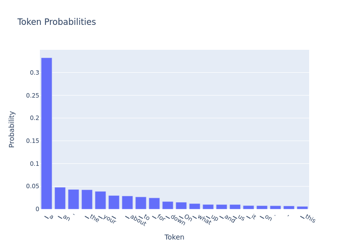
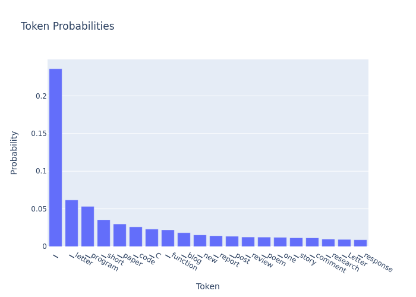
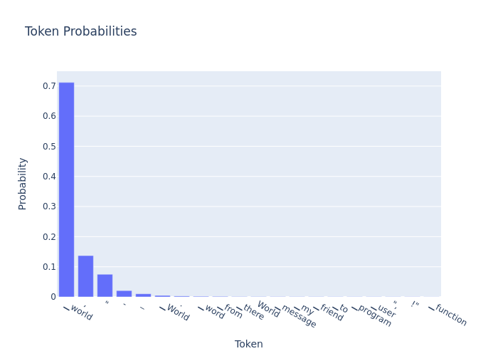
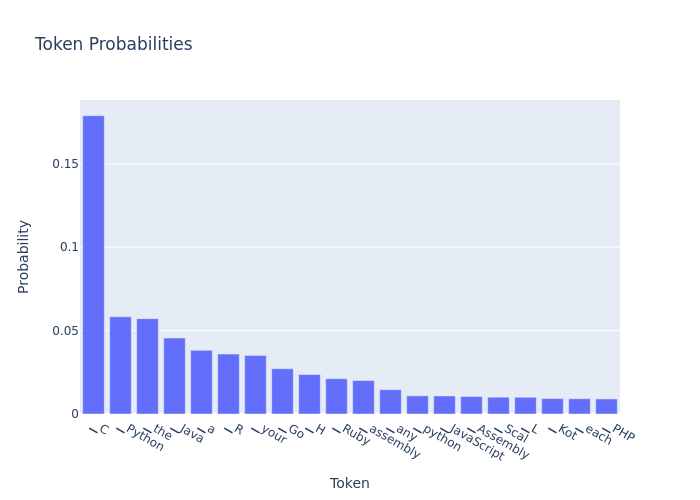

# Assignment 1.c
## 1. Metric Measurements
The following is a table of the metric measurements of Llama 2, Phi-2, and Mistral 7B fine-tuned on the [flytech/python-codes-25k](https://huggingface.co/datasets/flytech/python-codes-25k) dataset:

| Model       | BLEU  | Rouge-L | BERTScore | CodeBLEU | Human Evaluation |
|-------------|-------|---------|-----------|----------|------------------|
| Llama 2     | 0.64  | 0.28    | 0.74      | 0.83     | 1.00             |
| Phi-2       | 0.55  | 0.13    | 0.68      | 0.68     | 0.80             |
| Mistral 7B  | 0.67  | 0.27    | 0.72      | 0.81     | 1.00             |

In terms of overall evaluation, Llama 2 performed the best, Mistral 7B also performs very well, whereas Phi-2 is the least successful. The CodeBLEU metric appears to be the most appropriate metric for this task, as it takes into consideration of identifiers and other programming language concepts. BLEU is related to CodeBLEU and its metrics are not too far behind CodeBLEU. For human evaluation, Llama 2 and Mistral 7B produced completely accurate code, whereas Phi-2 produced 16/20 correct test samples.

## 2. Hyperparameter Tuning
The following is a table show the impact of various hyperparameter values of Llama 2, Phi-2, and Mistral 7B fine-tuned on the [flytech/python-codes-25k](https://huggingface.co/datasets/flytech/python-codes-25k) dataset:

| Model       | Top K | Beam Size | Temperature | BLEU  | Rouge-L | BERTScore | CodeBLEU | Human Evaluation |
|-------------|-------|-----------|-------------|-------|---------|-----------|----------|------------------|
| Llama 2     | 30    | 3         | 0.70        | 0.44  | 0.22    | 0.73      | 0.72     | 1.00             |
| Phi-2       | 10    | 3         | 0.50        | 0.37  | 0.18    | 0.62      | 0.65     | 0.85             |
| Mistral 7B  | 15    | 4         | 0.50        | 0.52  | 0.21    | 0.71      | 0.74     | 0.95             |

When tuning the hyperparameters of the models, the top k and temperature hyperparameters had a large effect on the generated output. To help Phi-2 have more optimal results, the top k was lowered to 10 and temperature was lowered to 0.5 to produce more conservative results, allowing it to introduce less irrelevant code. A similar tuning was done for Mistral 7B, however, this had the opposite effect where the model performed worse. To help explore more potential code sequences, the beam size was raised from 3 to 4 which slightly helped improve results. Llama 2 performed well at the default hyperparameter values.

# Assignment 2
## 1. Token Probabilities Visualization
### Premature Vocabulary Distribution Layers

### Final Layer

## 2. Discussion on Layer Consistency Checking
It is possible we could review layers for consistency checking and LLM explainability. However, there is a dramatic difference between the premature vocabulary distribution layers, and the final layers that are generated by the language model. Therefore, it is important to take the explainability in consideration by working backwards from the generated output, and figuring out which token probabilities were considered. In the final layer of the fine-tuned model's tokens, we can see that the generated tokens are related to programming languages, versus the first layer has generic english words.

## Layers and Metrics
| **Layer** | **BLEU** | **Rouge-L** | **BERTScore** | **CodeBLEU** |
|:---------:|:--------:|:-----------:|:-------------:|:------------:|
|  Layer 8  |    0.0   |     0.0     |     0.8268    |      0.0     |
|  Layer 16 |    0.0   |     0.0     |     0.8264    |      0.0     |
|  Layer 24 |    0.0   |     0.0     |     0.8379    |      0.0     |
|  Layer 32 |    0.0   |     0.0     |     0.8078    |      0.0     |

I attempted to have the fine-tuned Mistral-7B generate a specific Python program, but was not able to successfully get the expected output for this task. However, assuming that the output was successfully generated, the metrics would most likely improve as the layers keep getting higher. In particular, the BLEU score would most likely improve by having more vocabulary similar to the expected output.